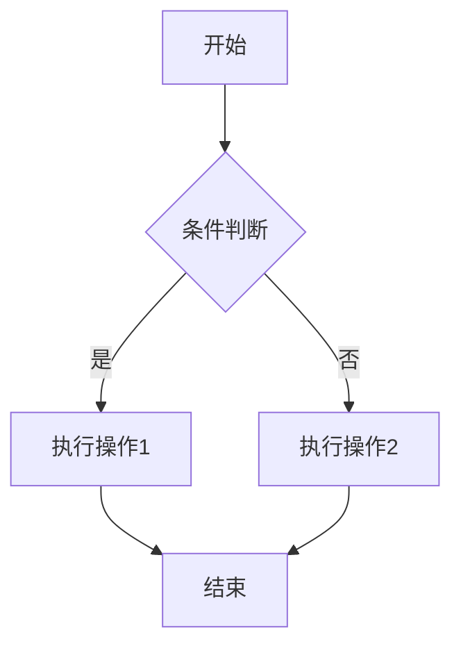

以下是 **数学+计算机领域高频Markdown语法总结**，结合学习（笔记/作业）、考试（公式/算法展示）、项目（文档/注释）场景，按「核心用途分类」，用表格+示例呈现，兼顾简洁性和实用性：


## 一、基础格式（通用必备）
| 用途         | Markdown语法                          | 示例效果                                  | 适用场景                  |
|--------------|---------------------------------------|-------------------------------------------|---------------------------|
| 标题         | `# 一级标题` `## 二级标题` ... `###### 六级标题` | # 一级标题<br>## 二级标题                  | 笔记结构、文档大纲        |
| 加粗         | `**内容**` 或 `__内容__`              | **重点公式/代码关键词**                   | 强调考点、核心概念        |
| 斜体         | `*内容*` 或 `_内容_`                  | *辅助说明/定理条件*                       | 补充说明、非核心信息      |
| 删除线       | `~~内容~~`                            | ~~废弃代码/错误思路~~                     | 标注过时内容、错题修正    |
| 换行         | 行尾加2个空格 + 回车                  | 第一行（空格+回车）<br>第二行             | 公式/代码块之间换行       |
| 分割线       | `---` 或 `***`（单独一行）            | ---                                       | 模块分隔（如笔记章节切换）|


## 二、计算机领域核心语法（代码/文件/链接）
### 1. 代码相关（高频中的高频）
| 用途         | Markdown语法                          | 示例效果                                  | 适用场景                  |
|--------------|---------------------------------------|-------------------------------------------|---------------------------|
| 行内代码     | `` `代码片段` ``                      | 调用 `printf()` 函数                      | 注释单个函数、变量、命令  |
| 代码块（带语法高亮） | ```语言名<br>代码内容<br>``` | ```java<br>public class Main {<br>    public static void main(String[] args) {<br>        System.out.println("Hello");<br>    }<br>}<br>``` | 算法实现、代码笔记、作业提交 |
| 代码块（行号） | 在代码块前加 `{.line-numbers}` | ```cpp{.line-numbers}<br>int a = 10;<br>for(int i=0; i<a; i++) {<br>    cout << i << endl;<br>}<br>``` | 标注代码行号（讲解算法时）|
| 终端命令     | ```bash<br>git clone https://xxx.git<br>npm install<br>``` | （同上，语法高亮为终端命令）              | 项目部署步骤、命令笔记    |

> 支持的计算机语言：`java` `cpp` `python` `c` `javascript` `go` `sql` `html` `css` 等，直接写语言名即可自动高亮。

### 2. 文件/链接相关
| 用途         | Markdown语法                          | 示例效果                                  | 适用场景                  |
|--------------|---------------------------------------|-------------------------------------------|---------------------------|
| 外部链接     | `[链接文本](URL "可选描述")`          | [GitHub](https://github.com "代码托管平台") | 引用官方文档、开源项目    |
| 内部文件链接 | `[笔记](./数据结构/二叉树.md)`        | [二叉树笔记](./数据结构/二叉树.md)        | 关联本地笔记文件（如课程大纲链接章节）|
| 图片链接     | ``           |          | 插入算法流程图、截图、公式示意图 |
| 锚点链接（跳转文档内） | `[跳转到标题](#二级标题)` | [跳转到代码相关](#1-代码相关（高频中的高频）) | 长文档内快速导航（如大型笔记、项目文档）|


## 三、数学领域核心语法（公式/符号）
基于「LaTeX语法」，Markdown原生支持（部分编辑器需开启数学渲染，如VS Code安装「Markdown Math」扩展）。

### 1. 公式基础
| 用途         | Markdown语法                          | 示例效果                                  | 适用场景                  |
|--------------|---------------------------------------|-------------------------------------------|---------------------------|
| 行内公式     | `$公式内容$`                          | 时间复杂度 $O(n\log n)$                   | 嵌入文字中的短公式（如复杂度、定理条件）|
| 块级公式（独立成行） | `$$公式内容$$` | $$\sum_{i=1}^n i = \frac{n(n+1)}{2}$$      | 复杂公式、定理、推导过程  |
| 公式编号     | `$$公式内容 \tag{1}$$` | $$a^2 + b^2 = c^2 \tag{1}$$               | 论文、作业中引用公式（如“由公式(1)可得”）|

### 2. 常用数学符号（直接套用）
| 类型         | Markdown语法（块级示例）               | 示例效果                                  |
|--------------|:-|-|
| 算术运算     | `$$a + b = c \quad a \times b = c \quad a \div b = c$$` | $$a + b = c \quad a \times b = c \quad a \div b = c$$ |
| 幂/根号      | `$$x^2 \quad x^{n} \quad \sqrt{x} \quad \sqrt[n]{x}$$` | $$x^2 \quad x^{n} \quad \sqrt{x} \quad \sqrt[n]{x}$$ |
| 微积分       | `$$\lim_{x \to 0} \frac{\sin x}{x} = 1 \quad \int_a^b f(x)dx$$` | $$\lim_{x \to 0} \frac{\sin x}{x} = 1 \quad \int_a^b f(x)dx$$ |
| 线性代数     | `$$\begin{bmatrix} 1 & 2 \\ 3 & 4 \end{bmatrix} \quad A_{i,j}$$` | $$\begin{bmatrix} 1 & 2 \\ 3 & 4 \end{bmatrix} \quad A_{i,j}$$ |
| 集合论       | `$$A \subseteq B \quad A \cup B \quad A \cap B \quad \emptyset$$` | $$A \subseteq B \quad A \cup B \quad A \cap B \quad \emptyset$$ |
| 逻辑符号     | `$$\forall x \quad \exists y \quad a \implies b \quad a \iff b$$` | $$\forall x \quad \exists y \quad a \implies b \quad a \iff b$$ |
|补充|`\sum\leq\sigma\infty`|$\sum\leq\sigma\infty$|
||`\epsilon,\zeta,\eta,\theta,\Gamma`|$\epsilon,\zeta,\eta,\theta,\Gamma$|
||`\Delta,\Theta,\Lambda,\Xi,\Pi,\Sigma,\Omega`|$\Delta,\Theta,\Lambda,\Xi,\Pi,\Sigma,\Omega$|
|括号|`$f(x)=\begin{cases}{b-a} & \text 0<x<2 \\ 0 & \text x \neq 0 \end{cases}$`|$f(x)=\begin{cases}{b-a} & \text 0<x<2 \\ 0 & \text x \neq 0 \end{cases}$|

> 技巧：复杂公式可先用「LaTeX在线编辑器」（如Overleaf）调试，再复制到Markdown中。


## 四、结构化展示（笔记/报告必备）
### 1. 列表
| 用途         | Markdown语法                          | 示例效果                                  |
|--------------|---------------------------------------|-------------------------------------------|
| 无序列表     | `- 项目1`<br>`- 项目2`<br>&nbsp;&nbsp;`- 子项目2.1` | - 项目1<br>- 项目2<br>&nbsp;&nbsp;- 子项目2.1 |
| 有序列表     | `1. 步骤1`<br>`2. 步骤2`<br>&nbsp;&nbsp;`1. 子步骤2.1` | 1. 步骤1<br>2. 步骤2<br>&nbsp;&nbsp;1. 子步骤2.1 |
| 任务列表     | `- [x] 完成Java作业`<br>`- [ ] 复习数据结构` | - [x] 完成Java作业<br>- [ ] 复习数据结构   |

### 2. 表格（对比/汇总）
| 用途         | Markdown语法                          | 示例效果                                  |
|--------------|---------------------------------------|-------------------------------------------|
| 基础表格     | `| 列1 | 列2 | 列3 |`<br>`|-----|-----|-----|`<br>`| 内容1 | 内容2 | 内容3 |` | | 列1 | 列2 | 列3 |<br>|-----|-----|-----|<br>| 内容1 | 内容2 | 内容3 | |
| 对齐方式     | `| 左对齐 | 居中 | 右对齐 |`<br>`| :--- | :---: | ---: |`<br>`| 1 | 2 | 3 |` | | 左对齐 | 居中 | 右对齐 |<br>| :--- | :---: | ---: |<br>| 1 | 2 | 3 | |

> 适用场景：算法复杂度对比、数据结构特性汇总、考试知识点梳理（如Java vs C++ 语法差异）。

### 3. 引用/注释
|用途|Markdown语法|示例效果|
|--------------|---------------------------------------|-------------------------------------------|
|文本引用| `> 引用内容（如定理、文档说明）`| > 引用内容（如定理、文档说明）|
|多级引用| `> 一级引用`<br>`>> 二级引用`| > 一级引用<br>>> 二级引用|
|脚注| `文本[^1]`<br>`[^1]: 脚注说明`| 文本[^1]<br>[^1]: 脚注说明（文档底部显示）|


## 五、进阶技巧（提升效率）
### 1. 图表（计算机/数学可视化）
Markdown支持「Mermaid语法」，可绘制流程图、时序图、数学图表（需编辑器支持，如VS Code安装「Mermaid Markdown Syntax Highlighting」）：

效果：
graph TD
    A[开始] --> B{条件判断}
    B -->|是| C[执行操作1]
    B -->|否| D[执行操作2]
    C --> E[结束]
    D --> E

### 2. VS Code 实用扩展（强化支持）
| 扩展名称               | 功能                                  |
|------------------------|---------------------------------------|
| Markdown Math          | 渲染数学公式（必备）                  |
| Mermaid Markdown       | 绘制流程图、时序图、饼图              |
| Markdown Preview Enhanced | 实时预览Markdown，支持公式、图表、锚点 |
| Code Spell Checker     | 检查语法拼写错误（避免公式/代码笔误） |


## 总结
- **计算机场景**：重点掌握「代码块（语法高亮+行号）、链接/锚点、表格」，用于算法笔记、项目文档、作业提交；
- **数学场景**：重点掌握「行内/块级公式、常用符号、公式编号」，用于定理推导、考试知识点记录、作业公式编写；
- **通用技巧**：用列表/表格结构化内容，用Mermaid绘制图表，配合VS Code扩展提升渲染和编辑效率。

直接复制示例语法修改即可使用，无需死记硬背，高频使用后自然熟练～