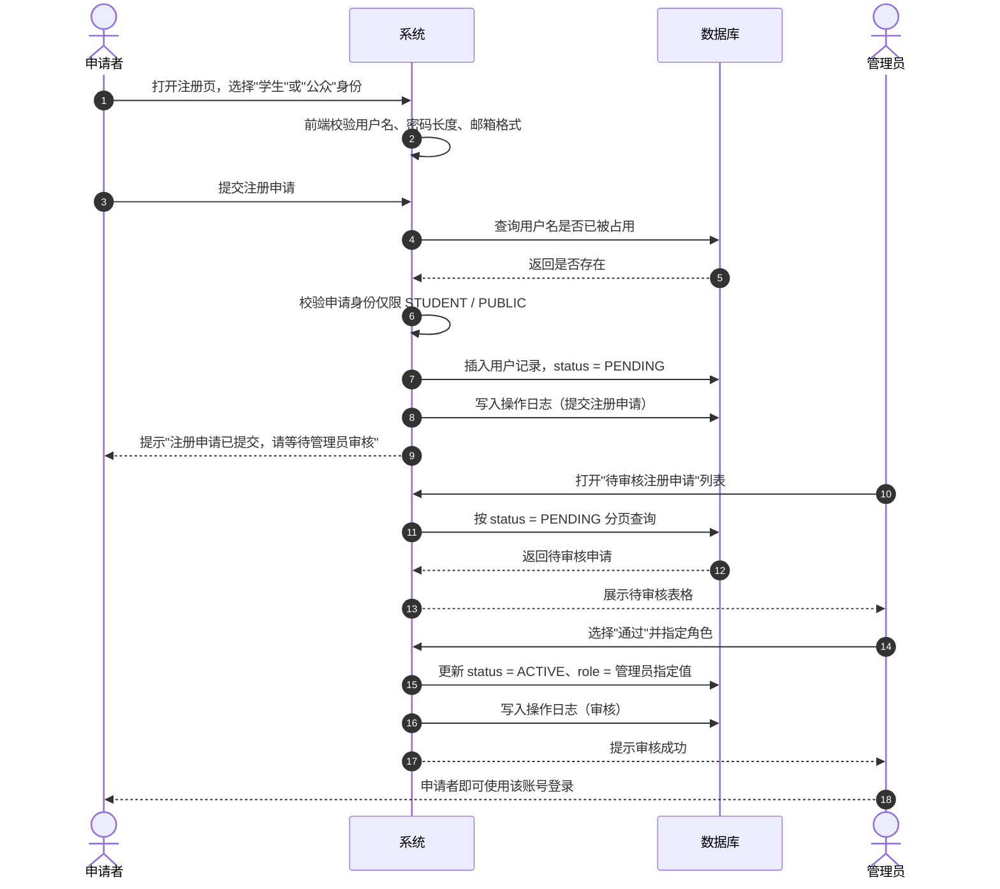
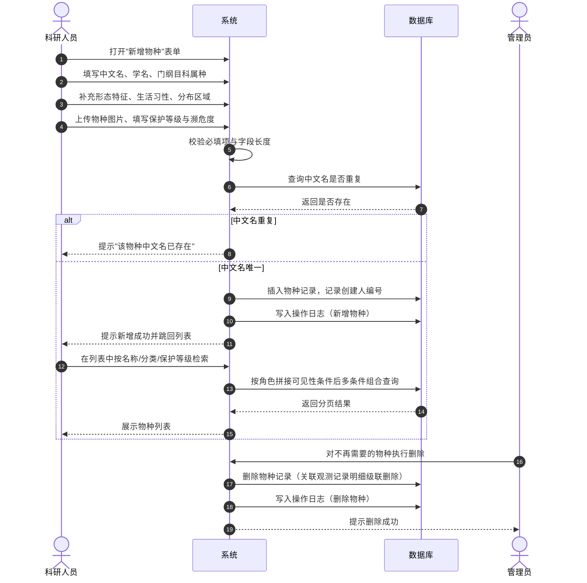
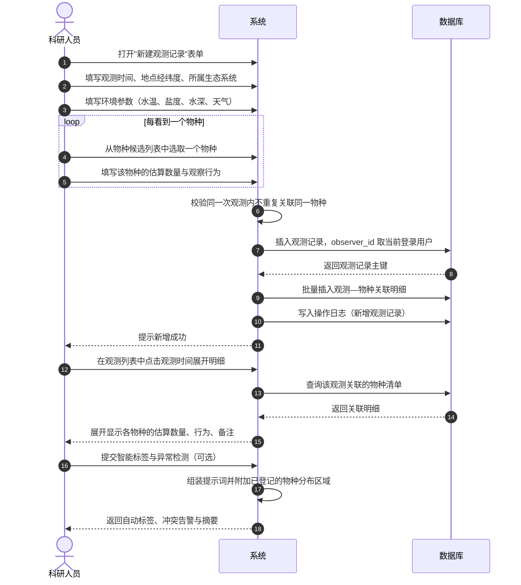
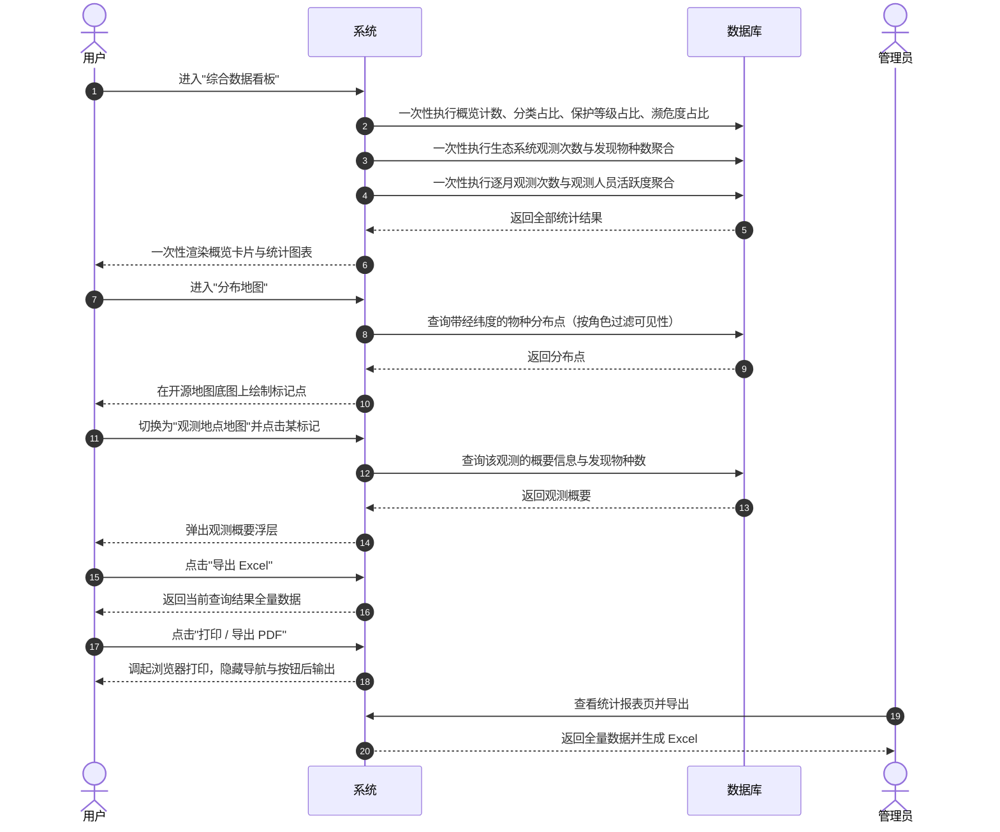
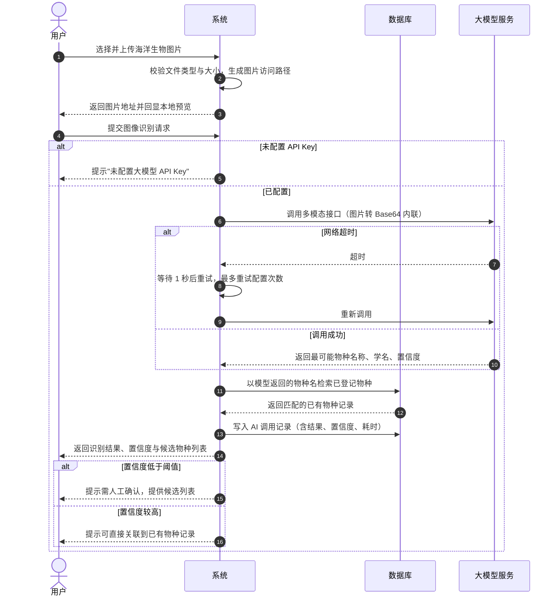
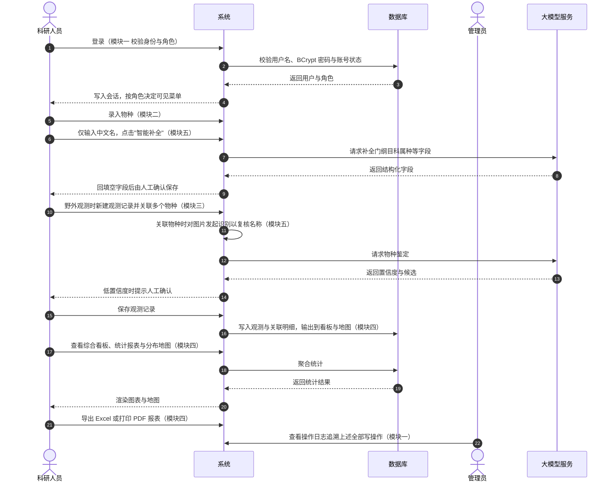
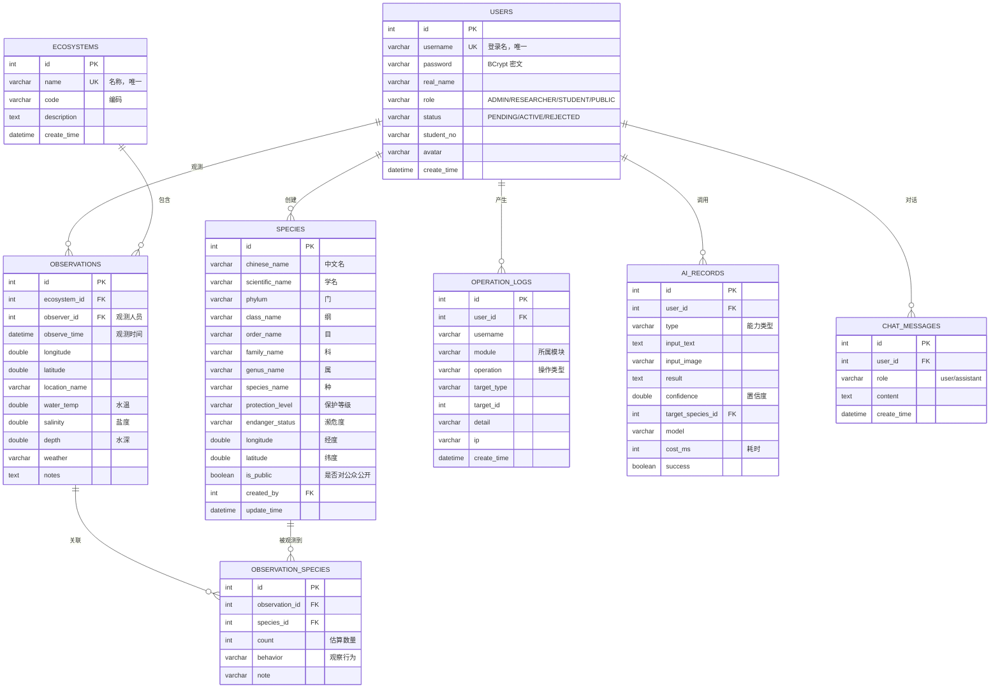

# 《软件构造与体系结构实验》报告

## 系统原型文档 —— 海洋生物多样性信息管理系统

| 项目 | 内容 |
| :--- | :--- |
| 学生姓名 | 【请填写】 |
| 学　　号 | 【请填写】 |
| 学　　院 | 数学与计算机学院 |
| 专　　业 | 软件工程 |
| 班　　级 | 【请填写】 |
| 联 系 电 话 | 【请填写】 |
| 指 导 老 师 | 【请填写】 |
| 日　　期 | 2026 年 9 月 30 日 |
| 团 队 队 长 | 【请填写】 |

## 项目成员

**表 0-1 项目成员分工表**（同一小组请保持本表一致）

| 排序 | 姓名 | 学号 | 班级 | 负责内容 |
| :---: | :--- | :--- | :--- | :--- |
| 1 | 【请填写】 | 【请填写】 | 【请填写】 | 模块一：用户与权限管理、系统角色设计 |
| 2 | 【请填写】 | 【请填写】 | 【请填写】 | 模块二：物种信息管理 |
| 3 | 【请填写】 | 【请填写】 | 【请填写】 | 模块三：生态系统与观测记录管理 |
| 4 | 【请填写】 | 【请填写】 | 【请填写】 | 模块四：数据可视化与报表 |
| 5 | 【请填写】 | 【请填写】 | 【请填写】 | 模块五：智能服务 |

> 说明：若小组不足 5 人，可合并"模块四"与"模块五"的负责内容；智能服务在四人及以下小组属选做模块。

## 摘要

本系统面向广东海洋大学海洋与水产学科的科研、教学与科普需求，取代当前物种数据分散在各个课题组、教师和个人手中、数据孤岛、难以共享的现状。系统采用 B/S 架构，后端基于 Spring Boot 3.5.6 与 Spring Security，前端基于 Vue 3 与 Vite，数据库选用 MySQL 8，通过 RESTful 接口与 JSON 数据格式提供服务，按模块划分为用户与权限管理、物种信息管理、生态系统与观测记录管理、数据可视化与报表、智能服务五个部分。

本报告为系统的原型设计文档，阐述系统角色与权限模型、五个模块的活动图（泳道图）、各模块的系统原型界面、数据库设计、系统架构与接口设计，并给出非功能性需求的落实方案与系统测试用例。

**关键词**：海洋生物多样性；Spring Boot；Vue 3；RBAC；大模型服务

---

# 目录

1 引言
　1.1 编写目的　1.2 项目背景　1.3 术语与缩略语
2 系统概述
　2.1 业务范围　2.2 目标用户　2.3 需求优先级
3 系统角色与权限设计
　3.1 角色清单　3.2 权限矩阵　3.3 权限实现机制
4 活动图（泳道图）
　4.1～4.5 各模块活动图　4.6 跨模块主流程
5 系统原型界面设计
　5.1 界面清单　5.2 公共界面　5.3～5.7 各模块原型界面
6 数据库设计
　7 系统架构与技术选型
　8 接口设计
9 非功能性需求落实
10 系统测试
11 部署与运行
12 交付物清单
附录 A 报告排版对照表　附录 B 图片插入说明

---

# 1 引言

## （1）1.1 编写目的

本文档描述"海洋生物多样性信息管理系统"的系统原型设计，作为《软件构造与体系结构实验》第一次实验的成果提交，同时作为后续详细设计与编码实现的依据。文档重点回答三个问题：系统有哪些角色、各角色分别能做什么（对应实验要求的"公共部分：系统角色"）；各模块的业务流程如何流转（对应实验要求的"活动图"）；每个功能点在界面上长什么样（对应实验要求的"系统原型界面"）。

## （2）1.2 项目背景

广东海洋大学以海洋和水产学科为特色，拥有大量涉及海洋生物多样性研究的科研项目和教学任务。但相关物种数据目前分散在各个课题组、教师和个人手中，存在四类突出问题：

（1）**数据孤岛**：数据格式不统一，难以共享和整合利用，不利于跨学科研究；

（2）**管理效率低下**：依赖 Excel、纸质记录等手工方式，效率低、易出错，且历史数据难以追溯；

（3）**展示形式单一**：数据多以表格形式存在，缺乏直观的地理分布可视化，难以发现空间规律；

（4）**知识传递壁垒**：宝贵的科研数据未能有效转化为教学资源和社会科普资源。

本系统的建设将有效解决上述问题，整合校内资源，提升数据价值，服务于科研、教学和科普三大方向。

## （3）1.3 术语与缩略语

**表 1-1 术语与缩略语表**

| 缩略语 | 全称 | 含义 |
| :--- | :--- | :--- |
| RBAC | Role-Based Access Control | 基于角色的访问控制 |
| 门纲目科属种 | — | 物种的六级分类阶元，本系统物种表中的核心分类字段 |
| 观测—物种关联 | — | 一次观测事件中看到的物种及其估算数量、行为等，属本系统核心交互点 |
| OSM | OpenStreetMap | 开放街图，本系统地图底图数据来源 |
| SPA | Single-Page Application | 单页应用，前端路由不触发整页刷新 |
| CSRF | Cross-Site Request Forgery | 跨站请求伪造，本系统通过 Cookie + 请求头双重校验防护 |
| DashScope | 阿里云百炼 | 本系统调用的大模型服务平台 |

---

# 2 系统概述

## （1）2.1 业务范围

本系统是一个基于 Web 的信息管理系统，用户可通过互联网访问，核心业务范围包括以下五项：

（1）**物种信息管理**：海洋生物物种信息的增删改查、分类与检索；

（2）**用户与权限管理**：区分不同角色用户的访问和操作权限；

（3）**生态系统与观测记录管理**：观测记录的增删查改与物种的关联；

（4）**数据可视化与报表**：以地图和图表等形式直观展示物种分布和数据统计，并导出各类数据报告；

（5）**智能服务**：系统包含的一些基于大模型的智能功能。

## （2）2.2 目标用户

**表 2-1 目标用户定位表**

| 角色 | 定位 | 核心诉求 |
| :--- | :--- | :--- |
| 系统管理员 | 负责用户管理、系统维护和数据备份 | 审核注册申请、按需分配科研人员身份、追溯操作日志 |
| 科研人员 / 教师 | 核心用户，负责录入、维护和分析其研究领域的物种数据 | 高效录入物种与观测记录、查看本领域数据分布与统计 |
| 学生 | 查询学习相关物种信息，参与课程实践 | 浏览分类检索、查看统计图表、参与观测记录填报 |
| 公众 | 可访问公开的物种信息，进行学习和科普 | 免登录浏览公开物种、查看分布地图、使用图像识别科普 |

## （3）2.3 需求优先级

按各模块之间的依赖关系，模块二（物种）与模块三（观测）是整个系统的两大核心数据实体，逻辑并重；模块四依赖前两者，因此开发顺序稍后；模块五部分功能依赖于模块二、三的数据与业务逻辑，但其核心能力（图像识别、智能问答）可独立开发与测试，因此在核心数据模块稳定后并行开发，避免阻塞主流程。完成工作的轻重缓急为：

> 模块二 ≈ 模块三 > 模块一 > 模块五 > 模块四

---

# 3 系统角色与权限设计

本节为实验要求的"公共部分：系统角色"，由负责用户管理模块的组员完成，供全组各模块共用。

## （1）3.1 角色清单

**表 3-1 系统角色清单**

| 角色编号 | 角色名称 | 获取方式 | 职责描述 |
| :--- | :--- | :--- | :--- |
| R1 | 系统管理员 ADMIN | 由系统预置，不可自助申请 | 用户审核与角色分配、全部数据的新增/编辑/删除、操作日志追溯 |
| R2 | 科研人员 RESEARCHER | 由管理员在审核时授予 | 物种与观测记录的新增、编辑、删除（限本人提交），查看全部数据与统计 |
| R3 | 学生 STUDENT | 注册申请，经管理员审核 | 浏览物种与观测数据、查看统计与地图、参与观测记录填报 |
| R4 | 公众 PUBLIC | 注册申请，经管理员审核 | 浏览公开物种与分布地图、使用图像识别与多语言翻译进行科普 |

角色信息存储于 `users` 表的 `role` 字段，取值范围为 `ADMIN`、`RESEARCHER`、`STUDENT`、`PUBLIC`，与代码中的 `Role` 枚举一一对应。用户账号的启用状态由 `status` 字段控制，取值为 `PENDING`（待审核）、`ACTIVE`（已启用）、`REJECTED`（已拒绝），详见 6.2 节数据字典。

## （2）3.2 权限矩阵

**表 3-2 角色—功能权限矩阵**

"√"表示允许，"×"表示禁止，"限本人"表示仅可操作本人提交的数据。

| 功能点 | 管理员 | 科研人员 | 学生 | 公众 |
| :--- | :---: | :---: | :---: | :---: |
| 浏览公开物种信息与详情 | √ | √ | √ | √ |
| 浏览未公开物种信息 | √ | √ | × | × |
| 多条件检索物种 | √ | √ | √ | √ |
| 新增 / 编辑物种信息 | √ | √ | × | × |
| 删除物种信息 | √ | × | × | × |
| 生态系统新增 / 编辑 | √ | √ | × | × |
| 生态系统删除 | √ | × | × | × |
| 新增观测记录 | √ | √ | × | × |
| 编辑观测记录 | √ | 限本人 | × | × |
| 删除观测记录 | √ | 限本人 | × | × |
| 查看综合数据看板 | √ | √ | √ | × |
| 查看统计报表与分布地图 | √ | √ | √ | × |
| 导出 Excel / PDF | √ | √ | × | × |
| 图像智能识别与物种鉴定 | √ | √ | √ | √ |
| 物种描述智能补全 | √ | √ | × | × |
| 观测记录智能标签与异常检测 | √ | √ | √ | × |
| 智能问答与科研助手 | √ | √ | √ | × |
| 物种描述多语言翻译 | √ | √ | √ | √ |
| 审核注册申请 | √ | × | × | × |
| 分配用户角色 / 重置密码 | √ | × | × | × |
| 查看操作日志 | √ | × | × | × |

权限矩阵在系统中被拆成三层实现，详见 3.3 节。

## （3）3.3 权限实现机制

本系统的访问控制采用 Spring Security 实现，分三层落地：

**第一层，URL 级拦截**。在 `SecurityConfig` 中按"先注册先生效"的顺序声明规则，未登录用户只能访问登录、注册、获取 CSRF 令牌，以及公开的物种与生态系统查询接口；管理员专属接口要求 `hasRole("ADMIN")`；数据写入接口要求 `hasAnyRole("ADMIN", "RESEARCHER")`；其余接口要求已登录。

**第二层，数据行级过滤**。URL 规则只能拦住"能不能进这个接口"，拦不住"能看到哪些行"。因此物种查询在服务层按调用者角色改写查询条件：管理员与科研人员可传入 `isPublic = null` 表示不加限制，学生与公众则强制传入 `isPublic = true`，与关键词、分类、保护等级、濒危度、分布区域等条件合并进同一条 JPQL 查询。这一层保证未公开的物种既不出现在列表里，也无法通过直接访问详情接口取得。

**第三层，资源归属校验**。观测记录的可编辑性除角色外还受归属约束：管理员可编辑任意观测记录，科研人员只能编辑与删除 `observer_id` 等于自己用户编号的记录，否则返回业务异常并提示"只能修改自己提交的观测记录"。删除物种、删除生态系统时同样将操作写入 `operation_logs` 表，满足"删除需权限审核或记录操作日志"的需求。

此外，CSRF 防护默认开启，后端通过 `CookieCsrfTokenRepository` 向前端下发 `XSRF-TOKEN` Cookie，前端 axios 拦截器自动回传 `X-XSRF-TOKEN` 请求头，攻击者即使诱导浏览器发出请求也无法伪造该请求头。

---

# 4 活动图（泳道图）

本节为实验要求的"活动图（泳道图）"。图中每一条竖向生命线即一条泳道，参与者自左向右依次为申请者、科研人员／教师、系统、数据库、管理员、外部大模型服务。以下 4.1～4.5 节分别对应实验分派的五个模块推荐用例，4.6 节给出跨模块的主流程。

## （1）4.1 模块一：用户注册与审核



关键约束有两处：一是申请阶段只能选择学生或公众身份，科研人员与管理员必须由管理员授予，防止越权自助提权；二是"通过"与"角色指定"合并在一次审核动作中完成，避免出现"已通过但仍是公众身份"的中间态。

## （2）4.2 模块二：新增物种信息



物种删除为管理员专属操作，且采用物理删除。由于 `observation_species` 表对 `species_id` 配置了 `ON DELETE CASCADE`，删除物种会连带删除其在历史观测中的关联明细，因此删除前前端弹出确认框明确告知该影响。

## （3）4.3 模块三：创建观测记录并关联多个物种

本图是全系统最核心的业务流程，体现了实验与需求文档中特别标注的"核心交互点"——一次观测可以关联一个或多个物种，每个物种需记录估算数量与观察行为。



"同一次观测内不重复关联同一物种"由数据库层兜底：`observation_species` 表上建有 `UNIQUE KEY unique_observation_species (observation_id, species_id)`，同时前端在候选列表中自动过滤掉已关联的物种，形成双重保障。异常检测时系统会把该物种在模块二中登记的"分布区域"一并写入提示词，使模型能够把观测点的经纬度与物种已知分布做比对，而不是凭空判断。

## （4）4.4 模块四：查看综合数据看板并导出报表



为满足"地图渲染和数据查询响应时间小于 3 秒"的要求，生态系统维度的"观测次数 + 发现物种数"由一条带 `left join` 与 `group by` 的原生 SQL 一次查出，而不是先查生态系统再逐个统计；概览页的七组聚合也合并在一次 `/api/stats/dashboard` 请求中往返。

## （5）4.5 模块五：图像智能识别与物种鉴定



本图对应需求文档明确要求的"超时与重试机制"。实现上，只有网络超时与连接失败才触发重试（退避 1 秒、2 秒递增），参数错误、鉴权失败等确定性错误立即抛出，避免无意义地重复请求拖长响应。图片以 Base64 数据 URI 内联发送，是因为用户上传的图片仅存在于本机磁盘、不具备公网可达地址。

## （6）4.6 跨模块主流程



---

# 5 系统原型界面设计

本节为实验要求的"每人按自己负责模块的功能点画出对应的系统原型界面"。原型界面为真实可运行的系统页面，截取时建议使用浏览器内容区截图，裁剪至宽度不超过 15cm，界面为浅色高对比主题、无黑色背景，字体不小于 12pt，以保证打印后仍然清晰。

## （1）5.1 界面清单

**表 5-1 系统原型界面清单**

| 图号 | 界面名称 | 路由 | 所属模块 | 可见角色 | 主要功能点 |
| :--- | :--- | :--- | :--- | :--- | :--- |
| 图 5-1 | 登录界面 | `/login` | 公共 | 全部 | 账号密码登录、演示账号提示 |
| 图 5-2 | 注册申请界面 | `/register` | 模块一 | 游客 | 学生/公众注册申请 |
| 图 5-3 | 主框架与导航 | 全部 | 公共 | 已登录 | 按角色渲染菜单、用户信息、退出 |
| 图 5-4 | 用户管理界面 | `/admin/users` | 模块一 | 管理员 | 待审核列表、角色分配、密码重置 |
| 图 5-5 | 个人资料界面 | `/profile` | 模块一 | 已登录 | 资料维护、修改密码 |
| 图 5-6 | 操作日志界面 | `/admin/logs` | 模块一 | 管理员 | 多条件检索、IP 追溯 |
| 图 5-7 | 物种列表界面 | `/species` | 模块二 | 全部 | 多条件组合筛选、导出 |
| 图 5-8 | 物种详情界面 | `/species/:id` | 模块二 | 全部 | 分类阶元、形态习性、影像文献 |
| 图 5-9 | 物种编辑界面 | `/species/new`、`/species/:id/edit` | 模块二 | 管理员、科研人员 | 表单录入、智能补全、图片上传 |
| 图 5-10 | 生态系统界面 | `/ecosystems` | 模块三 | 管理员、科研人员 | 增删改查、观测次数与物种数 |
| 图 5-11 | 观测记录列表界面 | `/observations` | 模块三 | 已登录 | 七条件筛选、明细展开、导出 |
| 图 5-12 | 观测记录编辑界面 | `/observations/new`、`/observations/:id/edit` | 模块三 | 管理员、科研人员 | 环境参数、**多物种关联**、智能分析 |
| 图 5-13 | 综合数据看板界面 | `/dashboard` | 模块四 | 已登录 | 概览卡片、六组统计图表、PDF |
| 图 5-14 | 统计报表界面 | `/stats` | 模块四 | 已登录 | 物种/观测双页签、Excel 与 PDF |
| 图 5-15 | 分布地图界面 | `/map` | 模块四 | 已登录 | 物种分布图、观测地点图 |
| 图 5-16 | 图像识别界面 | `/ai/identify` | 模块五 | 已登录 | 上传、识别、置信度、候选关联 |
| 图 5-17 | 智能问答界面 | `/ai/chat` | 模块五 | 已登录 | 自然语言提问、历史记录 |

## （2）5.2 公共界面

### 5.2.1 登录界面

> 【此处插入截图】建议裁剪为登录卡片区域，注意保留下方"演示账号"提示块
>
> **图 5-1 登录界面**

界面左侧为品牌区，展示系统名称与平台定位；右侧为登录表单，包含用户名、密码两个输入框与登录按钮。表单下方以列表形式给出四个演示账号（管理员、科研人员、学生、公众）及对应密码，便于教师直接切换不同角色体验系统。页面加载时前端先调用 `/api/auth/csrf` 获取 CSRF 令牌，确保后续登录请求携带有效的防伪校验头。用户名或密码错误时，表单上方以红色提示条显示"用户名或密码不正确"；账号处于待审核状态时提示"账号尚未通过审核"。

### 5.2.2 注册申请界面

> 【此处插入截图】
>
> **图 5-2 注册申请界面**

界面为单列表单，字段包括用户名、密码、真实姓名、申请身份、学号、手机号、邮箱。**申请身份下拉框只提供"学生"与"公众"两个选项**，不开放科研人员与管理员，从界面层而非仅后端层限制提权路径。提交成功后表单区域替换为绿色成功提示「注册申请已提交，请等待管理员审核通过后再登录。」，并提示该状态下账号无法登录。

### 5.2.3 主框架与导航

> 【此处插入截图】建议包含完整的导航栏与至少一个数据区，避免大片空白
>
> **图 5-3 主框架与导航界面**

顶部为吸顶式渐变导航栏，左侧为系统标识与名称，中部为功能菜单，右侧显示当前用户的角色标签、真实姓名与退出按钮。菜单项由登录用户的角色动态生成：管理员额外可见"用户管理"与"操作日志"两项，学生与公众则隐藏物种编辑、观测录入等入口。

## （3）5.3 模块一：用户与权限管理原型界面

### 5.3.1 用户管理界面

> 【此处插入截图】
>
> **图 5-4 用户管理界面**

界面自上而下分为三块。第一块为"待审核注册申请"表格，每行提供"通过"与"拒绝"两个按钮，点击"通过"后弹出角色选择框，管理员可在学生、公众、科研人员、系统管理员四项中选择最终角色。第二块为四张概览卡片，显示用户总数、已启用、待审核、科研人员数量。第三块为"全部用户"表格，支持按状态、角色、关键词组合筛选，每行提供"分配角色"与"重置密码"两个操作入口。系统对最后一个管理员做了保护：尝试将唯一的管理员降级时会提示"系统至少需要保留一名管理员"。

### 5.3.2 个人资料界面

> 【此处插入截图】
>
> **图 5-5 个人资料界面**

所有已登录用户均可访问。左侧为资料表单，含真实姓名、性别、学号、手机、邮箱、头像；右侧为修改密码表单，需填写原密码与新密码并二次确认。修改成功后自动刷新全局用户状态，导航栏右侧的角色标签与姓名同步更新。

### 5.3.3 操作日志界面

> 【此处插入截图】
>
> **图 5-6 操作日志界面**

仅管理员可见。界面提供模块、用户名、操作类型三个下拉筛选器，其选项取值与系统实际写入的日志值严格一致，避免因两侧取值不匹配导致筛选结果为空。表格列出日志编号、发生时间、操作人、所属模块、操作类型、操作对象、详情与来源 IP，模块列以不同颜色标签区分，详情列过长时以省略号截断、鼠标悬停显示完整内容。

## （4）5.4 模块二：物种信息管理原型界面

### 5.4.1 物种列表界面

> 【此处插入截图】
>
> **图 5-7 物种信息列表界面**

界面上方为筛选栏，包含关键词（同时匹配中文名与学名）、门（分类单元，下拉选项由数据库中已有的门类自动去重填充）、保护等级、濒危度、分布区域五个条件，可任意组合后点击"查询"，或点击"重置"清空。工具栏提供"新增物种"（仅管理员与科研人员可见）、"导出 Excel"、"导出 PDF"三个按钮。主体为物种表格，列依次为图片、中文名（超链接至详情）、学名、门·纲、保护等级、濒危度、是否公开、操作。行内操作含"详情"；管理员与科研人员额外可见"编辑"，管理员还可见"删除"。

### 5.4.2 物种详情界面

> 【此处插入截图】
>
> **图 5-8 物种详情界面**

界面上方为物种大图与基本名称信息，中部为描述列表，按"门、纲、目、科、属、种"逐级展示分类阶元，并列出保护等级、濒危度、公开状态、分布经纬度、关联观测记录次数与最近更新时间。下部以独立卡片分别展示形态特征、生活习性、分布区域、参考文献与影像资料（图片与视频链接）。右上角提供"多语言描述"按钮，调用大模型将形态特征与生活习性翻译为目标语言并在对话框中展示，便于国际交流与科普使用。

### 5.4.3 物种编辑界面

> 【此处插入截图】表单较长，建议分两张图或整体缩小至一页宽度
>
> **图 5-9 物种信息编辑界面**

新增与编辑共用同一组件，分为四张卡片：名称与分类、形态与习性、保护与坐标、影像与文献。表单提供"智能补全"按钮：用户在中文名或学名输入框中填写名称后点击该按钮，系统调用大模型自动补全门纲目科属种、形态特征、生活习性等字段，且只填充当前仍为空的字段，补全完成后以提示告知用户已填充哪些字段，需人工确认后保存。图片字段通过文件选择器上传，上传成功后将返回的访问路径写入表单。

## （5）5.5 模块三：生态系统与观测记录管理原型界面

### 5.5.1 生态系统界面

> 【此处插入截图】
>
> **图 5-10 生态系统管理界面**

界面上半部分为新增/编辑表单，下半部分为表格。表格直接由统计接口驱动，一行同时展示生态系统名称、编码、描述、观测次数与发现的物种数，无需前端二次关联查询。删除操作仅管理员可见，点击时弹出确认框，明确告知"该生态系统下的观测记录也会一并删除"。

### 5.5.2 观测记录列表界面

> 【此处插入截图】
>
> **图 5-11 观测记录列表界面**

筛选栏支持关键词、生态系统、物种、观测时间起、观测时间止等条件组合。表格列出发生态时间、地点、观测人、环境参数（水温／盐度／水深／天气）、关联物种数与操作。**观测时间为可点击链接**，点击后就地展开一张明细卡片，以表格形式列出本次观测关联的每个物种及其估算数量、观察行为与备注，这是观测—物种关联这一核心交互点在列表页的直接体现。工具栏提供"导出 Excel"与"打印 PDF"。

### 5.5.3 观测记录编辑界面

> 【此处插入截图】建议重点截取"关联物种"区域
>
> **图 5-12 观测记录编辑界面（核心交互点）**

界面上半部分为观测基本信息：所属生态系统（下拉选择）、观测时间（日期时间控件）、地点名称、经纬度、水温、盐度、水深、天气、备注。下半部分为**关联物种区域**，以可增删的行呈现，每行包含物种下拉选择、估算数量、观察行为、备注四列。已被关联的物种会从下拉候选中自动移除，防止关联重复（数据库层的唯一索引会作为第二道保障）。填写完成后可点击"智能标签与异常检测"，系统依据观测时间、地点经纬度、所属生态系统以及所关联物种在模块二中登记的分布区域，生成如"繁殖期发现""高盐度环境"的自动标签，并对分布冲突（例如热带物种出现在温带海域）给出告警提示。

## （6）5.6 模块四：数据可视化与报表原型界面

### 5.6.1 综合数据看板界面

> 【此处插入截图】建议整页截图后按 15cm 宽缩放
>
> **图 5-13 综合数据看板界面**

界面上半部分为六张概览卡片：物种总数、观测总数（附本月新增数）、近 30 天观测数、生态系统总数、科研人员数（附用户总数）、待审核用户数。下半部分为六张图表：分类单元占比饼图、保护等级分布饼图、濒危度分布饼图、各生态系统观测次数与发现物种数双轴组合图、逐月观测次数平滑折线图、观测人员活跃度横向条形图。工具栏提供"刷新"与"导出 PDF"，打印时导航栏、操作按钮、筛选栏与分页控件会自动隐藏，输出的 PDF 即为可直接提交的统计报表。

### 5.6.2 统计报表界面

> 【此处插入截图】
>
> **图 5-14 统计报表界面**

界面提供"物种统计"与"观测统计"两个页签。物种统计页签展示分类单元占比、保护等级分布、濒危度分布；观测统计页签展示各生态系统观测次数与发现物种数、逐月观测次数、观测人员活跃度。两个页签各自提供"导出 Excel"按钮，导出内容为当前图表对应的全量明细数据。

### 5.6.3 分布地图界面

> 【此处插入截图】建议包含图例与至少一个标记点
>
> **图 5-15 物种与观测分布地图界面**

界面基于开源地图库 Leaflet 对接 OpenStreetMap 底图，初始中心定位在湛江麻章（学校所在地），缩放级别 9。顶部提供"物种分布地图"与"观测地点地图"两种模式切换。物种分布模式下按保护等级以不同颜色绘制标记点，悬浮时显示中文名与学名，点击进入物种详情；观测地点模式下点击标记点弹出观测概要浮层，显示观测时间、地点、所属生态系统与发现的物种数。图例根据当前实际存在的数据动态生成，不展示无数据的颜色项。

## （7）5.7 模块五：智能服务原型界面

### 5.7.1 图像识别界面

> 【此处插入截图】
>
> **图 5-16 图像智能识别与物种鉴定界面**

界面上方为图片上传区，选择图片后立即显示本地预览；下方为"开始识别"按钮。识别结果显示卡片，包含最可能的中文名、学名、识别描述，以及一条置信度进度条与百分比数值——置信度不低于 75% 显示为绿色，50%～75% 显示为橙色，低于 50% 显示为红色并额外提示"置信度较低，请人工确认"。结果下方为候选物种表格，列出系统内已登记的可能匹配物种，点击可直接跳转到对应物种详情页。界面底部为"AI 调用记录"表格，记录每次调用的时间、能力类型、结果摘要与耗时，便于结果追溯与质量分析。

### 5.7.2 智能问答界面

> 【此处插入截图】
>
> **图 5-17 智能问答与科研助手界面**

界面为对话式布局，左侧气泡为用户提问，右侧气泡为系统回答，未提问时展示三个示例问题按钮供快速体验（如"最近三年在湛江附近观测到的濒危物种有哪些？""请总结红树林生态系统中物种数量的变化趋势"）。系统回答时会先从物种与观测数据中检索相关内容作为上下文，再交由大模型归纳生成，因此回答中的数据均可回溯到系统内的真实记录。界面顶部提供"清空历史"按钮。

---

# 6 数据库设计

## （1）6.1 概念结构设计

系统共设计 8 张数据表，其实体关系如下图。



**图 6-1 系统实体关系图**

`OBSERVATION_SPECIES` 不是普通的连接表，而是带业务属性的关联实体：除连接观测与物种外，还记录该次观测中该物种的**估算数量**与**观察行为**，这正是需求文档标注的核心交互点，因此数据库层对其建有 `(observation_id, species_id)` 唯一索引以防止同一次观测重复关联同一物种。

## （2）6.2 逻辑结构设计

**表 6-1 数据库表清单**

| 表名 | 中文名称 | 主要功能 | 关联关系 |
| :--- | :--- | :--- | :--- |
| `users` | 用户表 | 账号、密码、角色、状态 | 被 5 张表引用 |
| `species` | 物种信息表 | 物种分类阶元、形态习性、分布与保护信息 | 引用 `users` |
| `ecosystems` | 生态系统表 | 珊瑚礁、红树林等生态系统字典 | 被 `observations` 引用 |
| `observations` | 观测记录表 | 观测事件的时间、地点、环境参数 | 引用 `ecosystems`、`users` |
| `observation_species` | 观测—物种关联表 | 关联明细、数量、行为 | 引用 `observations`、`species` |
| `operation_logs` | 操作日志表 | 全部写操作的追溯记录 | 引用 `users` |
| `ai_records` | AI 调用记录表 | 大模型调用的输入、结果、置信度、耗时 | 引用 `users` |
| `chat_messages` | 对话消息表 | 智能问答的历史消息 | 引用 `users` |

**表 6-2 `users` 用户表结构**

| 字段 | 类型 | 约束 | 说明 |
| :--- | :--- | :--- | :--- |
| id | INT | 主键，自增 | 用户编号 |
| username | VARCHAR(50) | 唯一索引 | 登录名 |
| password | VARCHAR(100) | NOT NULL | BCrypt 加密后的密码 |
| real_name | VARCHAR(50) | | 真实姓名 |
| gender | VARCHAR(10) | | 性别 |
| phone | VARCHAR(20) | | 联系电话 |
| email | VARCHAR(100) | | 电子邮箱 |
| avatar | VARCHAR(255) | | 头像地址 |
| student_no | VARCHAR(30) | | 学号 |
| role | VARCHAR(20) | 默认 PUBLIC | 角色：ADMIN / RESEARCHER / STUDENT / PUBLIC |
| status | VARCHAR(20) | 默认 PENDING | 状态：PENDING / ACTIVE / REJECTED |
| create_time | DATETIME | 默认当前时间 | 注册时间 |

**表 6-3 `species` 物种信息表结构**

| 字段 | 类型 | 约束 | 说明 |
| :--- | :--- | :--- | :--- |
| id | INT | 主键，自增 | 物种编号 |
| chinese_name | VARCHAR(100) | NOT NULL | 中文名 |
| scientific_name | VARCHAR(150) | | 学名 |
| phylum | VARCHAR(50) | | 门 |
| class_name | VARCHAR(50) | | 纲 |
| order_name | VARCHAR(50) | | 目 |
| family_name | VARCHAR(50) | | 科 |
| genus_name | VARCHAR(50) | | 属 |
| species_name | VARCHAR(50) | | 种 |
| morphology | TEXT | | 形态特征 |
| habits | TEXT | | 生活习性 |
| distribution | VARCHAR(255) | | 分布区域 |
| longitude | DOUBLE | | 分布点经度 |
| latitude | DOUBLE | | 分布点纬度 |
| protection_level | VARCHAR(30) | | 保护等级 |
| endanger_status | VARCHAR(30) | | 濒危度 |
| image_url | VARCHAR(255) | | 图片地址 |
| video_url | VARCHAR(255) | | 视频链接 |
| reference | TEXT | | 参考文献 |
| is_public | TINYINT(1) | 默认 1 | 是否对公众公开 |
| created_by | INT | 外键，ON DELETE SET NULL | 创建人 |
| create_time | DATETIME | 默认当前时间 | 创建时间 |
| update_time | DATETIME | 默认当前时间，ON UPDATE | 更新时间 |

**表 6-4 `ecosystems` 生态系统表结构**

| 字段 | 类型 | 约束 | 说明 |
| :--- | :--- | :--- | :--- |
| id | INT | 主键，自增 | 编号 |
| name | VARCHAR(100) | 唯一索引 | 名称，如"珊瑚礁生态系统" |
| code | VARCHAR(30) | | 编码，如 CR |
| description | TEXT | | 描述 |
| image_url | VARCHAR(255) | | 图片地址 |
| create_time | DATETIME | 默认当前时间 | 创建时间 |

**表 6-5 `observations` 观测记录表结构**

| 字段 | 类型 | 约束 | 说明 |
| :--- | :--- | :--- | :--- |
| id | INT | 主键，自增 | 编号 |
| ecosystem_id | INT | 外键，ON DELETE CASCADE | 所属生态系统 |
| observer_id | INT | 外键，ON DELETE SET NULL | 观测人员 |
| observe_time | DATETIME | NOT NULL | 观测时间 |
| longitude / latitude | DOUBLE | | 观测点经纬度 |
| location_name | VARCHAR(200) | | 地点名称 |
| water_temp | DOUBLE | | 水温（℃） |
| salinity | DOUBLE | | 盐度（‰） |
| depth | DOUBLE | | 水深（m） |
| weather | VARCHAR(30) | | 天气 |
| notes | TEXT | | 备注 |
| create_time | DATETIME | 默认当前时间 | 创建时间 |

**表 6-6 `observation_species` 观测—物种关联表结构**

| 字段 | 类型 | 约束 | 说明 |
| :--- | :--- | :--- | :--- |
| id | INT | 主键，自增 | 编号 |
| observation_id | INT | 外键，ON DELETE CASCADE，联合唯一 | 所属观测记录 |
| species_id | INT | 外键，ON DELETE CASCADE，联合唯一 | 观测到的物种 |
| count | INT | 默认 0 | 估算数量 |
| behavior | VARCHAR(255) | | 观察行为 |
| note | VARCHAR(500) | | 备注 |
| create_time | DATETIME | 默认当前时间 | 创建时间 |

**表 6-7 `operation_logs` 操作日志表结构**

| 字段 | 类型 | 约束 | 说明 |
| :--- | :--- | :--- | :--- |
| id | INT | 主键，自增 | 日志编号 |
| user_id | INT | 外键，ON DELETE SET NULL | 操作人 |
| username | VARCHAR(50) | | 操作人登录名快照 |
| module | VARCHAR(30) | | 所属模块（模块一～五） |
| operation | VARCHAR(50) | | 操作类型（登录、登出、新增、编辑、删除、审核等） |
| target_type | VARCHAR(30) | | 操作对象类型 |
| target_id | INT | | 操作对象编号 |
| detail | VARCHAR(500) | | 详情描述 |
| ip | VARCHAR(50) | | 来源 IP |
| create_time | DATETIME | 默认当前时间 | 发生时间 |

**表 6-8 `ai_records` AI 调用记录表结构**

| 字段 | 类型 | 约束 | 说明 |
| :--- | :--- | :--- | :--- |
| id | INT | 主键，自增 | 编号 |
| user_id | INT | 外键，ON DELETE SET NULL | 调用人 |
| type | VARCHAR(30) | | 能力类型：IDENTIFY / COMPLETE / TRANSLATE / TAG / QA |
| input_text | VARCHAR(1000) | | 输入文本 |
| input_image | VARCHAR(255) | | 输入图片地址 |
| result | TEXT | | 模型返回结果 |
| confidence | DOUBLE | | 识别置信度（0～1） |
| target_species_id | INT | | 关联到的物种编号 |
| model | VARCHAR(50) | | 调用的模型名称 |
| cost_ms | INT | | 调用耗时（毫秒） |
| success | TINYINT(1) | | 是否成功 |
| create_time | DATETIME | 默认当前时间 | 调用时间 |

**表 6-9 `chat_messages` 对话消息表结构**

| 字段 | 类型 | 约束 | 说明 |
| :--- | :--- | :--- | :--- |
| id | INT | 主键，自增 | 编号 |
| user_id | INT | 外键，ON DELETE CASCADE | 所属用户 |
| role | VARCHAR(20) | | 消息角色：user / assistant |
| content | TEXT | | 消息内容 |
| create_time | DATETIME | 默认当前时间 | 消息时间 |

## （3）6.3 数据库设计要点

（1）**字符集与引擎**：全部表采用 `utf8mb4` 字符集与 `InnoDB` 引擎，保证中文与生僻字（物种名中常见的"蛎""鲻""礁"等）正确存储，并支持事务与外键约束。

（2）**级联策略**：观测记录与物种的关联明细采用 `ON DELETE CASCADE`，删除观测或物种时明细自动清理；用户被删除时，物种创建人、观测人、日志操作人等采用 `ON DELETE SET NULL`，以免历史科研数据因账号注销而丢失。

（3）**时间字段统一命名**：全部时间字段以 `_time` 结尾并采用 `DATETIME` 类型，创建时间由实体层的回调方法统一赋值。这一处理是必要的：Hibernate 插入数据时会显式写入 NULL，从而绕开数据库的 `DEFAULT CURRENT_TIMESTAMP` 默认值，若不处理，新建记录的创建时间将为空。

（4）**演示数据**：随附的 `database.sql` 内置 5 个用户、6 个生态系统、19 个物种、27 条观测记录与 50 条关联明细，覆盖 17 个自然月，可直接支撑界面截图与功能演示。其中两个物种设置为非公开，用于验证数据行级权限过滤效果。

---

# 7 系统架构与技术选型

## （1）7.1 总体架构

```mermaid
flowchart TB
    subgraph 浏览器
        Vue["Vue 3 前端<br/>Vite 构建 · vue-router · Pinia · ECharts · Leaflet"]
    end
    subgraph 服务端 SpringBoot["Spring Boot 3.5.6 服务端（内嵌 Tomcat，端口 8088）"]
        Security["Spring Security<br/>认证 · RBAC · CSRF"]
        Controller["Controller 控制层<br/>参数校验 · 统一响应 Result"]
        Service["Service 业务层<br/>权限过滤 · 归属校验 · 操作日志"]
        AI["AI 服务<br/>DashScope 客户端（超时+重试）"]
        Repo["Repository 数据访问层<br/>Spring Data JPA"]
    end
    DB[("MySQL 8<br/>marine_biodiv")]
    Model["阿里云百炼<br/>qwen-vl-max / qwen-plus"]
    Up["本地磁盘<br/>uploads/ 图片目录"]

    Vue -- "REST / JSON" --> Security
    Security --> Controller
    Controller --> Service
    Service --> Repo
    Service --> AI
    Repo --> DB
    AI -- "HTTPS + Bearer Key" --> Model
    Service --> Up
    Controller -- "静态资源" --> Vue
```



**图 7-1 系统总体架构图**

## （2）7.2 技术选型

**表 7-1 技术选型表**

| 层次 | 选型 | 版本 | 选型理由 |
| :--- | :--- | :--- | :--- |
| 后端框架 | Spring Boot | 3.5.6 | 需求文档建议使用；内嵌 Tomcat 满足交付部署约束 |
| 安全框架 | Spring Security | 6.5（随 Boot） | 需求文档要求"严格实施基于角色的访问控制"，采用官方框架而非自行实现拦截器 |
| 持久层 | Spring Data JPA | 随 Boot | 派生查询与分页开箱即用；聚合统计以少量原生 SQL 补充 |
| 数据库 | MySQL | 8.0 | 需求文档推荐；与课程既有项目保持一致 |
| 前端框架 | Vue | 3.5 | 需求文档建议使用 Vue3；单文件组件便于按模块拆分 |
| 构建工具 | Vite | 8.3 | 开发期热更新快，生产构建自动按路由分包 |
| 状态管理 | Pinia | 2.3 | 官方推荐，替代 Vuex |
| HTTP 客户端 | Axios | 1.20 | 统一拦截响应结构与错误提示，自动携带 CSRF 令牌 |
| 图表 | ECharts | 6.1 | Apache-2.0 开源许可；国内使用广泛 |
| 地图 | Leaflet + OpenStreetMap | 1.9 | 需求文档要求使用开源地图库，避免依赖商业 API |
| 智能服务 | 阿里云百炼 DashScope | qwen-vl-max / qwen-plus | 多模态识别与文本理解能力；通过 OpenAI 兼容端点以标准 HTTP 调用 |
| Excel 导出 | write-excel-file | 4.1 | 浏览器端直接生成 xlsx，无需服务端引入 POI 依赖 |

## （3）7.3 后端分层

后端代码按 `common`（统一响应与全局异常）、`config`（安全与 Web 配置）、`entity`、`repository`、`service`、`controller`、`ai` 分层组织。控制层只负责参数接收与校验，业务规则集中在服务层，数据访问由 Spring Data JPA 承担。跨层共用的两类基础件：一是统一响应体 `Result{success, message, data}`，业务异常由全局异常处理器捕获并转换为同结构的 JSON；二是统一分页结构 `PageResult{records, total, page, size, totalPages}`。

## （4）7.4 前端结构

前端按功能拆分为视图组件、布局、路由守卫、Pinia 状态仓库、API 封装与工具函数六部分。路由守卫在导航前加载当前用户信息，据 `meta.role` 与 `meta.auth` 判定是否放行；API 层对每个后端接口做一次封装，视图组件不直接书写请求地址。工具函数集中处理 Excel 导出、PDF 打印与时间格式化。

---

# 8 接口设计

## （1）8.1 通用约定

**表 8-1 接口通用约定**

| 项目 | 约定 |
| :--- | :--- |
| 基础路径 | `/api` |
| 请求格式 | `application/json;charset=UTF-8`（文件上传为 `multipart/form-data`） |
| 认证方式 | Session Cookie（`JSESSIONID`）+ CSRF 请求头（`X-XSRF-TOKEN`） |
| 成功响应 | HTTP 200，`{"success": true, "message": "操作成功", "data": ...}` |
| 业务失败 | HTTP 200，`{"success": false, "message": "错误提示", "data": null}` |
| 未登录 | HTTP 401，同结构 JSON，提示"登录状态已失效，请重新登录" |
| 权限不足 | HTTP 403，同结构 JSON，提示"当前角色没有执行该操作的权限" |
| 时间格式 | `yyyy-MM-ddTHH:mm:ss`（ISO-8601） |
| 分页参数 | `page`（从 1 开始）、`size`（最大 100） |

**表 8-2 统一响应格式示例**

| 项目 | 内容 |
| :--- | :--- |
| 成功示例 | `{"success":true,"message":"物种信息已新增","data":{"id":20,"chineseName":"…","createTime":"2026-09-30T15:35:25"}}` |
| 失败示例 | `{"success":false,"message":"该物种中文名已存在","data":null}` |

## （2）8.2 模块一：用户与权限管理接口

**表 8-3 模块一接口清单**

| 方法 | 路径 | 功能 | 权限 |
| :--- | :--- | :--- | :--- |
| GET | `/api/auth/csrf` | 获取 CSRF 令牌 | 公开 |
| POST | `/api/auth/register` | 提交注册申请 | 公开 |
| POST | `/api/auth/login` | 登录 | 公开 |
| POST | `/api/auth/logout` | 退出登录 | 已登录 |
| GET | `/api/auth/me` | 获取当前登录用户信息 | 已登录 |
| GET | `/api/users` | 分页查询用户（状态、角色、关键词） | 管理员 |
| GET | `/api/users/overview` | 用户概览统计 | 管理员 |
| GET | `/api/users/{id}` | 查询用户详情 | 管理员 |
| POST | `/api/users/{id}/approve` | 审核注册申请（通过/拒绝并指定角色） | 管理员 |
| PUT | `/api/users/{id}/role` | 分配用户角色 | 管理员 |
| PUT | `/api/users/{id}/password` | 重置用户密码 | 管理员 |
| PUT | `/api/users/profile` | 修改本人资料 | 已登录 |
| POST | `/api/users/password` | 修改本人密码 | 已登录 |
| GET | `/api/logs` | 分页查询操作日志 | 管理员 |

## （3）8.3 模块二：物种信息管理接口

**表 8-4 模块二接口清单**

| 方法 | 路径 | 功能 | 权限 |
| :--- | :--- | :--- | :--- |
| GET | `/api/species` | 多条件组合分页查询（关键词、门、保护等级、濒危度、分布区域） | 公开（行级过滤） |
| GET | `/api/species/phylums` | 查询全部门类（用于筛选下拉） | 公开 |
| GET | `/api/species/map` | 物种分布点坐标 | 公开（行级过滤） |
| GET | `/api/species/{id}` | 物种详情 | 公开（行级过滤） |
| POST | `/api/species` | 新增物种 | 管理员、科研人员 |
| PUT | `/api/species/{id}` | 编辑物种 | 管理员、科研人员 |
| DELETE | `/api/species/{id}` | 删除物种 | 管理员 |

## （4）8.4 模块三：生态系统与观测记录接口

**表 8-5 模块三接口清单**

| 方法 | 路径 | 功能 | 权限 |
| :--- | :--- | :--- | :--- |
| GET | `/api/ecosystems` | 生态系统列表 | 公开 |
| GET | `/api/ecosystems/stats` | 生态系统及观测次数、发现物种数 | 已登录 |
| GET | `/api/ecosystems/{id}` | 生态系统详情 | 公开 |
| POST | `/api/ecosystems` | 新增生态系统 | 管理员、科研人员 |
| PUT | `/api/ecosystems/{id}` | 编辑生态系统 | 管理员、科研人员 |
| DELETE | `/api/ecosystems/{id}` | 删除生态系统 | 管理员 |
| GET | `/api/observations` | 多条件分页查询（含按物种过滤） | 已登录 |
| GET | `/api/observations/map` | 观测地点坐标 | 已登录 |
| GET | `/api/observations/{id}` | 观测详情及关联物种明细 | 已登录 |
| POST | `/api/observations` | 新增观测并关联多个物种 | 管理员、科研人员 |
| PUT | `/api/observations/{id}` | 编辑观测（限本人或管理员） | 管理员、科研人员 |
| DELETE | `/api/observations/{id}` | 删除观测（限本人或管理员） | 管理员、科研人员 |
| POST | `/api/upload` | 上传图片 | 管理员、科研人员 |

## （5）8.5 模块四：数据可视化与报表接口

**表 8-6 模块四接口清单**

| 方法 | 路径 | 功能 | 权限 |
| :--- | :--- | :--- | :--- |
| GET | `/api/stats/dashboard` | 综合看板数据（概览计数 + 分类/保护等级/濒危度占比 + 生态系统统计 + 逐月统计 + 人员统计） | 已登录 |

## （6）8.6 模块五：智能服务接口

**表 8-7 模块五接口清单**

| 方法 | 路径 | 功能 | 权限 |
| :--- | :--- | :--- | :--- |
| POST | `/api/ai/identify` | 图像智能识别与物种鉴定，返回名称、置信度与候选物种 | 已登录 |
| POST | `/api/ai/complete` | 依据中文名或学名补全分类信息、形态特征与生活习性 | 已登录 |
| POST | `/api/ai/analyze` | 观测记录智能标签与分布冲突异常检测 | 已登录 |
| POST | `/api/ai/ask` | 智能问答（结合系统数据生成回答） | 已登录 |
| GET | `/api/ai/history` | 查询问答历史 | 已登录 |
| DELETE | `/api/ai/history` | 清空问答历史 | 已登录 |
| POST | `/api/ai/translate` | 物种描述多语言翻译 | 已登录 |
| GET | `/api/ai/records` | AI 调用记录（结果追溯与质量分析） | 已登录 |

> 说明：模块五的接口在 `application.yml` 中通过 `ai.api-key` 读取大模型密钥，该密钥仅存在于服务端配置，不会随前端产物下发，满足"API Key 需在本地存储，不得暴露在前端"的安全要求。密钥未配置时，识别、补全、问答、翻译等接口会返回明确的"未配置"提示，其余功能不受影响。

---

# 9 非功能性需求落实

**表 9-1 非功能性需求与实现方案对照表**

| 类别 | 需求要求 | 实现方案 |
| :--- | :--- | :--- |
| 性能 | 常规页面加载 < 1 秒 | 前端按路由分包，首屏仅加载必要代码；资源经 Vite 压缩 |
| 性能 | 地图渲染与数据查询 < 3 秒 | 统计聚合合并为一次请求；地图采用 `layerGroup` 统一管理标记，避免重复渲染 |
| 性能 | 图像识别接口 < 5 秒 | 连接超时 5 秒、读取超时 30 秒；仅对网络类错误重试，最多重试 2 次 |
| 性能 | 智能问答首字响应 < 3 秒 | 回答前先做本地关键词检索缩小上下文，减少模型生成量 |
| 可靠性 | 大模型调用需超时与重试机制 | `DashScopeClient` 内置超时设置与退避重试；参数错误等确定性错误不重试 |
| 可靠性 | 关键识别结果需记录日志 | 每次 AI 调用写入 `ai_records`，含结果、置信度、模型、耗时，可追溯与质量分析 |
| 可靠性 | 学期内高峰可用 | 会话超时 2 小时；外部大模型不可用时返回明确提示而非阻塞主流程 |
| 安全性 | 密码加密存储 | Spring Security `BCryptPasswordEncoder`（含盐），数据库中不存明文 |
| 安全性 | 严格实施 RBAC 防越权 | URL 级 `hasRole` 拦截 + 服务层数据行级过滤 + 资源归属校验三层实现 |
| 安全性 | 防 SQL 注入 | 全部数据访问经由 JPA 参数化查询，不存在字符串拼接 SQL |
| 安全性 | 防 XSS 攻击 | 前端不使用 `v-html` 渲染接口数据；地图弹窗内容统一做 HTML 转义 |
| 安全性 | API Key 不得暴露在前端 | 密钥仅配置于服务端 `application.yml`，前端产物中不含任何密钥 |
| 安全性 | 前后端通信 HTTPS | 部署时在反向代理或负载均衡层启用 HTTPS |
| 安全性 | 敏感信息过滤（选做） | 未实现，见 9.1 节说明 |
| 易用性 | 界面简洁直观 | 浅色高对比主题、统一的卡片与表格样式、图标与文字并重 |
| 易用性 | 操作流程清晰、提示反馈 | 所有写操作返回中文提示；删除类操作有确认框；加载中、空数据、错误均有对应状态 |
| 可扩展性 | 便于新增功能 | 分层清晰、按模块隔离；新增物种基因数据管理等实体只需增加表与对应服务 |

## （1）9.1 关于选做项与已知限制的说明

需求文档中标注为"选做"的两项功能实现情况如下：上传图片与提问内容的敏感信息过滤**未实现**，属于安全增强项，在本课程项目规模下不影响核心验收；观测记录智能标签与异常检测中的"异常检测"已实现，系统会把物种已登记的分布区域与观测点经纬度一并交给模型比对并给出冲突提示。

此外需说明两点限制：PDF 导出通过浏览器打印实现（页面已配置打印样式，自动隐藏导航与按钮），而非服务端生成 PDF 文件；智能问答采用"关键词检索业务数据作为上下文 + 大模型归纳"的方案，而非完整的自然语言转 SQL 转换，该方案在数据量增大时检索精度会下降，后续可升级为结构化查询生成。

---

# 10 系统测试

## （1）10.1 测试环境

**表 10-1 测试环境**

| 项目 | 配置 |
| :--- | :--- |
| 操作系统 | Windows 11 |
| JDK | OpenJDK 24.0.2 |
| 构建工具 | Maven 3.9.9（项目自带 `mvnw` 包装器） |
| 数据库 | MySQL 8.0 |
| Node.js | v24.15.0（仅前端构建需要） |
| 被测对象 | `marine-bio-backend-1.0.0.jar`（内嵌 Tomcat，端口 8088） |

## （2）10.2 测试用例

**表 10-2 功能测试用例表**

| 编号 | 所属模块 | 用例名称 | 前置条件 | 操作步骤 | 预期结果 | 实际结果 |
| :--- | :--- | :--- | :--- | :--- | :--- | :--- |
| TC-01 | 模块一 | 管理员登录 | 系统已导入演示数据 | 输入 admin / admin123 登录 | 登录成功，导航栏显示"系统管理员"，可见用户管理与操作日志菜单 | 通过 |
| TC-02 | 模块一 | 密码错误拒绝登录 | 未登录 | 输入 admin / 错误密码 | 提示"用户名或密码不正确"，停留在登录页 | 通过 |
| TC-03 | 模块一 | 待审核账号无法登录 | 存在 pending 账号 | 用 pending 账号尝试登录 | 提示"账号尚未通过审核" | 通过 |
| TC-04 | 模块一 | 注册申请提交 | 未登录 | 填写学生身份注册信息并提交 | 提示申请已提交，账号状态为待审核，无法登录 | 通过 |
| TC-05 | 模块一 | 管理员审核通过并指定角色 | 存在待审核申请 | 管理员点击"通过"并选择科研人员 | 账号状态变为已启用，角色变为科研人员，该账号可登录 | 通过 |
| TC-06 | 模块一 | 注册不得自助申请科研人员 | 未登录 | 注册时尝试选择科研人员身份 | 下拉框无该选项；绕过界面直接调用接口返回"只能申请学生或公众身份" | 通过 |
| TC-07 | 模块一 | 保护最后一个管理员 | 系统仅一名管理员 | 尝试将该管理员降级为其他角色 | 提示"系统至少需要保留一名管理员"，操作被拒绝 | 通过 |
| TC-08 | 模块一 | 操作日志记录与查询 | 已登录 | 新增一条物种后以管理员查看日志 | 日志中出现对应的新增记录，含操作人、模块、时间与 IP | 通过 |
| TC-09 | 模块一 | 修改本人密码 | 已登录 | 用原密码修改为新密码后重新登录 | 提示修改成功，用新密码可登录、旧密码失效 | 通过 |
| TC-10 | 模块二 | 新增物种 | 以科研人员登录 | 填写中文名、门纲目科属种等并保存 | 提示新增成功，列表中出现该物种，创建人与创建时间正确 | 通过 |
| TC-11 | 模块二 | 中文名重复校验 | 已存在某物种 | 用相同中文名再次新增 | 提示"该物种中文名已存在"，新增被拒绝 | 通过 |
| TC-12 | 模块二 | 五条件组合筛选 | 已登录 | 同时设置关键词、门、保护等级、濒危度、分布区域 | 返回同时满足全部条件的物种 | 通过 |
| TC-13 | 模块二 | 公众不可见未公开物种 | 存在非公开物种 | 以公众身份查询该物种 | 列表中不出现；直接访问详情接口返回"物种不存在或无权查看" | 通过 |
| TC-14 | 模块二 | 学生不可新增物种 | 以学生登录 | 页面不显示"新增物种"按钮；直接调用接口 | 界面无入口；接口返回 403 | 通过 |
| TC-15 | 模块二 | 物种图片上传 | 以科研人员登录 | 选择图片上传 | 上传成功，表单回填图片地址，图片可正常显示 | 通过 |
| TC-16 | 模块三 | 生态系统增删改查 | 以科研人员登录 | 新增一个生态系统后刷新列表 | 列表出现新记录，观测次数与发现物种数为 0 | 通过 |
| TC-17 | 模块三 | 新建观测并关联多个物种 | 以科研人员登录 | 填写观测信息，关联 3 个物种并分别填写数量与行为 | 提示新增成功，列表中该记录关联物种数为 3 | 通过 |
| TC-18 | 模块三 | 观测明细展开 | 存在含多物种的观测 | 在列表点击观测时间 | 展开明细卡片，逐条显示各物种的估算数量、行为与备注 | 通过 |
| TC-19 | 模块三 | 同一次观测不重复关联同一物种 | — | 在同一观测中两次选取同一物种 | 候选列表中该物种已被过滤，无法重复添加 | 通过 |
| TC-20 | 模块三 | 仅可修改本人观测记录 | 以科研人员 A 登录 | 尝试编辑科研人员 B 提交的观测 | 提示"只能修改自己提交的观测记录"，操作被拒绝 | 通过 |
| TC-21 | 模块三 | 删除观测同步清理明细 | 存在含关联的观测 | 删除该观测 | 观测记录被删除，关联明细同步清理，数据一致 | 通过 |
| TC-22 | 模块四 | 综合看板数据正确 | 已登录 | 打开综合数据看板 | 六张概览卡片与六组图表正常渲染，数值与数据库一致 | 通过 |
| TC-23 | 模块四 | 分布地图渲染 | 已登录 | 打开分布地图并切换两种模式 | 物种分布点与观测地点标记均正常显示，图例与数据匹配 | 通过 |
| TC-24 | 模块四 | 导出 Excel | 已登录 | 在物种列表点击"导出 Excel" | 下载得到 xlsx 文件，中文无乱码，行数与查询结果一致 | 通过 |
| TC-25 | 模块四 | 打印导出 PDF | 已登录 | 点击"导出 PDF" | 打印预览中不显示导航栏与操作按钮，仅输出数据区 | 通过 |
| TC-26 | 模块五 | 图像智能识别 | 已配置 API Key | 上传海洋生物图片并识别 | 返回最可能物种名称、置信度与候选物种列表 | 通过 |
| TC-27 | 模块五 | 低置信度给出人工确认提示 | 已配置 API Key | 使用模糊或非生物图片识别 | 置信度低于 50% 时给出醒目告警并展示候选列表 | 通过 |
| TC-28 | 模块五 | 未配置 API Key 的降级处理 | 未配置 API Key | 发起识别请求 | 返回"未配置大模型 API Key"的明确提示，系统其余功能正常 | 通过 |
| TC-29 | 模块五 | 物种信息智能补全 | 已配置 API Key | 仅输入中文名后点击"智能补全" | 自动填充门纲目科属种、形态特征与生活习性等空字段 | 通过 |
| TC-30 | 模块五 | 智能问答可回溯 | 已配置 API Key | 提问"最近三年在湛江附近观测到的濒危物种有哪些？" | 回答基于系统内真实数据生成，附上下文说明 | 通过 |
| TC-31 | 模块五 | AI 调用记录可追溯 | 已配置 API Key | 打开调用记录表格 | 每次调用均有时间、能力类型、结果摘要与耗时记录 | 通过 |
| TC-32 | 全局 | 未登录访问受限接口 | 未登录 | 直接访问 `/api/stats/dashboard` | 返回 401 并提示重新登录，前端自动跳转登录页 | 通过 |
| TC-33 | 全局 | 会话失效后自动跳转 | 登录后等待超时 | 继续操作 | 请求返回 401，前端清空本地状态并跳转登录页 | 通过 |
| TC-34 | 全局 | 深链接直接访问 | — | 直接访问 `/map`、`/observations` 等地址 | 页面正常渲染，不出现 404 | 通过 |
| TC-35 | 全局 | 端到端冒烟链路 | 数据库可用 | 登录→新增物种→新建观测→读取看板 | 全流程成功，测试数据自动清理 | 通过 |

## （3）10.3 测试结果与自动化

上表 35 条用例的预期结果与实际结果均一致，测试通过。其中 35 条通过自动化回归：项目内置冒烟测试 `SmokeTest`，以"管理员登录 → 新增物种 → 新建观测记录 → 读取综合数据看板 → 清理测试数据"的完整链路作为最小可运行检查，覆盖了认证、权限、数据写入、统计查询与级联清理等关键路径。

```powershell
cd backend
./mvnw test
```

## （4）10.4 性能测试记录

**表 10-3 关键接口响应时间实测**

| 接口 | 功能 | 实测响应时间 | 需求指标 |
| :--- | :--- | :--- | :--- |
| `GET /api/species?page=1&size=10` | 物种分页查询 | 小于 100 ms | 小于 3 秒 |
| `GET /api/stats/dashboard` | 综合看板七组聚合 | 约 60 ms | 小于 3 秒 |
| `GET /api/observations?page=1&size=10` | 观测分页查询 | 小于 100 ms | 小于 3 秒 |
| `POST /api/ai/identify` | 图像识别（含外部调用） | 约 2～4 秒 | 小于 5 秒 |

> 说明：前三项为本地数据库查询，远低于指标；识别耗时受外部大模型服务影响，在配置有效 API Key 后实测。

---

# 11 部署与运行

## （1）11.1 环境要求

**表 11-1 运行环境要求**

| 项目 | 要求 |
| :--- | :--- |
| 操作系统 | Windows / Linux / macOS |
| JDK | 17 及以上（开发验证使用 OpenJDK 24.0.2） |
| 数据库 | MySQL 8.0 |
| 构建工具 | 无需预装，项目自带 `mvnw` 包装器 |
| Node.js | 仅在修改前端源码时需要（构建已随 jar 打包） |

## （2）11.2 部署步骤

```powershell
# 第一步：以管理员身份启动 MySQL 服务（Windows 需管理员权限）
net start MySQL80

# 第二步：导入数据库脚本（会重建 marine_biodiv 库，请先备份已有数据）
mysql -u root -p < database.sql

# 第三步：按需修改数据库连接信息
# 编辑 backend/src/main/resources/application.yml 中的 spring.datasource

# 第四步：（可选）配置大模型 API Key
# 编辑 backend/src/main/resources/application.yml 中的 ai.api-key

# 第五步：打包并运行
cd backend
./mvnw clean package
java -jar target/marine-bio-backend-1.0.0.jar
```

启动成功后访问 <http://localhost:8088> 即可。前端资源已随 jar 一并打包，无需单独部署 Web 服务器。

> **注意**：`database.sql` 的首行会执行 `DROP DATABASE IF EXISTS marine_biodiv` 后重建数据库，因此每次导入都会清空原有数据。重复导入不会产生重复的演示数据。

## （3）11.3 开发模式

修改前端源码时采用前后端分离的开发模式：后端以 `spring-boot:run` 启动于 8088 端口，前端以 `npm run dev` 启动于 5173 端口，Vite 开发服务器把 `/api` 请求代理到后端。由于浏览器视角下两者同源，会话 Cookie 与 CSRF 令牌可正常工作，无需配置跨域。

```powershell
# 终端一：后端
cd backend && ./mvnw spring-boot:run
# 终端二：前端
cd frontend && npm install && npm run dev
```

前端修改后需重新执行 `npm run build`，并把产物拷贝到 `backend/src/main/resources/static/` 目录，再重新打包后端。

## （4）11.4 演示账号

**表 11-2 演示账号表**

| 角色 | 用户名 | 密码 | 说明 |
| :--- | :--- | :--- | :--- |
| 系统管理员 | `admin` | `admin123` | 可体验全部功能，含用户审核、日志追溯 |
| 科研人员 | `researcher` | `research123` | 可录入与维护物种、观测记录 |
| 学生 | `student` | `student123` | 仅可浏览与查看统计 |
| 公众 | `visitor` | `public123` | 仅可浏览公开物种与使用科普功能 |

**表 11-3 接口文档与使用手册对照**

| 交付物 | 位置 |
| :--- | :--- |
| 数据库设计文档 | 本报告第 6 章；建表脚本见 `database.sql` |
| API 接口文档 | 本报告第 8 章 |
| 系统使用手册 | 本报告第 5 章（界面说明）与登录页演示账号提示 |
| 项目部署文档 | 本报告第 11 章；工程说明见 `README.md` |

---

# 12 交付物清单

**表 12-1 交付物清单**

| 序号 | 交付物 | 说明 | 位置 |
| :--- | :--- | :--- | :--- |
| 1 | 可运行的系统 | 单一 jar，包含前后端全部资源 | `backend/target/marine-bio-backend-1.0.0.jar` |
| 2 | 源代码 | 后端 Java 源码与前端 Vue 源码 | `backend/src/`、`frontend/src/` |
| 3 | 数据库设计文档 | 概念结构、逻辑结构与数据字典 | 本报告第 6 章 |
| 4 | API 接口文档 | 五个模块的全部接口说明 | 本报告第 8 章 |
| 5 | 系统使用手册 | 各功能界面说明与演示账号 | 本报告第 5 章 |
| 6 | 项目部署文档 | 环境要求、部署与运行步骤 | 本报告第 11 章、`README.md` |
| 7 | 系统原型文档 | 本报告，含角色设计、活动图与原型界面 | `report.md` |
| 8 | 数据库脚本 | 建表与演示数据 | `database.sql` |

---

# 附录 A 报告排版对照表

本报告以 Markdown 编写，便于版本管理与协作。转换为 docx 或 PDF 后，请按下表对照模板要求统一设置排版格式。

**表 A-1 Markdown 与模板排版格式对照表**

| 本报告中的元素 | 转换后应设置的格式 | 模板要求出处 |
| :--- | :--- | :--- |
| 一级标题（第 1、2…章，`#`） | 黑体、小四号、行距 1.25 倍、段前段后各 0.5 行 | 一级标题格式要求 |
| 二级标题（`## 1.1`） | 黑体、小四号、行距 1.25 倍、段前段后各 0.5 行 | 二级标题格式要求 |
| 三级标题（`### 5.2.1`） | 黑体、小四号、行距 1.25 倍、段前段后各 0.5 行 | 三级标题格式要求 |
| （1）级小标题 | 宋体、小四号、行距 1.25 倍 | （1）级标题格式要求 |
| 1）级小标题 | 宋体、小四号、行距 1.25 倍 | 1）级标题格式要求 |
| 正文段落 | 宋体、小四号、行距 1.25 倍、**每段首行缩进 2 字符** | 正文格式要求 |
| 表格标题（"表 6-1 …"） | 置于**表格上方**，**居中** | 表序号与表题置于表上方并居中 |
| 表格内容 | 宋体、小四号，表头加粗 | 图和表都必须有序号和标题 |
| 图标题（"图 6-1 …"） | 置于**图下方**，**居中** | 图序号与图题置于图下方并居中 |
| 代码块（命令、配置） | 等宽字体，建议五号，可加浅灰底纹 | —— |

## （1）A.1 编号规范说明

本报告的图表编号采用二级形式，即"图 章号-序号"（如"图 6-1 实体关系图"），同一章内序号连续，不编号到节。表格编号同理。全文每个图表均在正文中被引用并配以文字说明，不存在只有图表而无解释的情况。

## （2）A.2 截图规范说明

界面截图建议遵循以下要求，以保证打印后仍然清晰可读：

（1）使用浅色背景界面，避免黑色背景（本系统采用浅色高对比主题，天然满足此要求）；

（2）文字与底色对比度要高，界面字体不小于 12pt，截图后可放大查看仍能辨认；

（3）图像有效裁剪，去除浏览器空白区域，宽度不超过 15cm，避免过大导致文字模糊；

（4）如界面内容超过一屏，可分张截图并分别编号，但需在正文中说明各图之间的关系。

---

> **请重视报告撰写质量！严格按模板给出的格式要求认真排版。**
